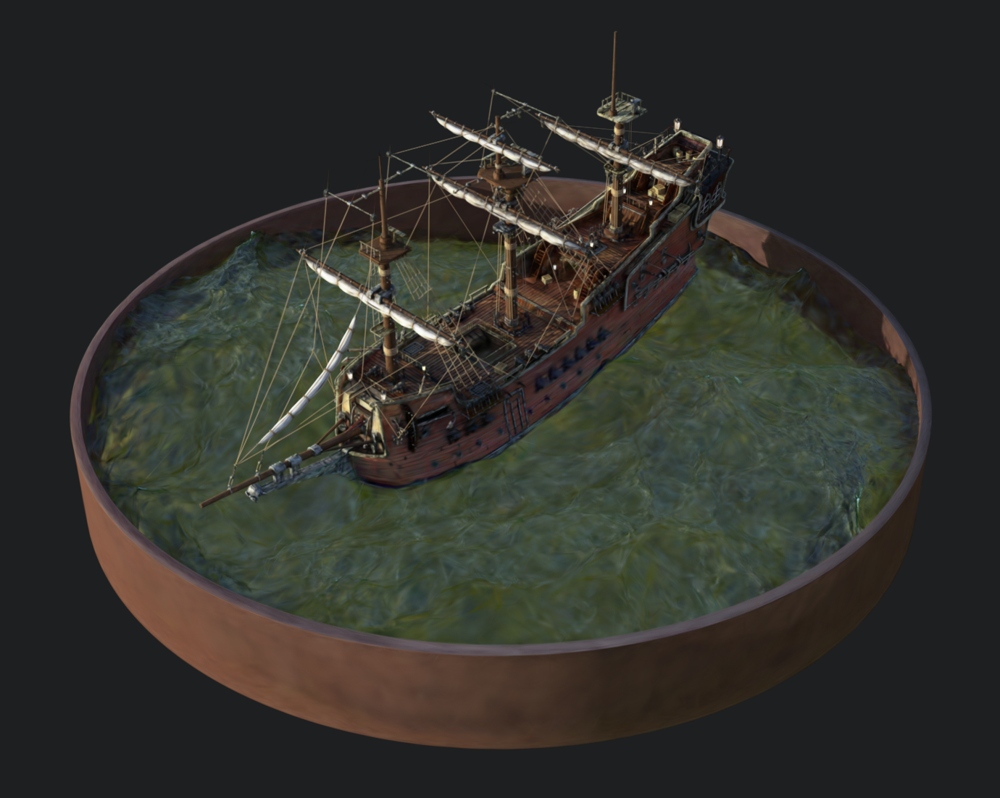
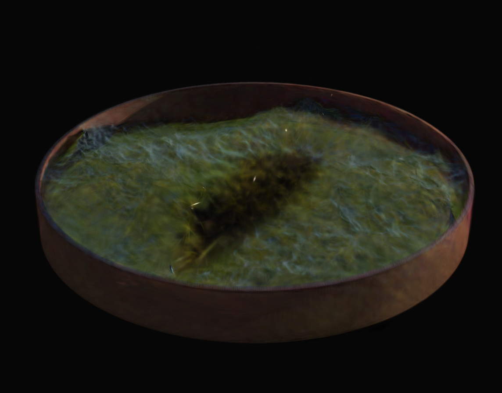

# Segmentation in Gaussian Splatting
Inspired from [Interactive Segmentation in Radiance Fields (ISRF)](https://github.com/rahul-goel/isrf_code) and adapted to Gaussian Splatting.
 
Work done as part of the course project for Computer Vision at IIIT Hyderabad.

## Methodology
The segmentation pipeline consists of two main steps:
1. **Feature Training**: Extract features from the dataset using a pre-trained feature extractor. In this case, we use the DiNO feature extractor from [N3F](https://github.com/dichotomies/N3F).
2. **Clustering**: Cluster the features to get the final segmentation. The clustering is done using KMeans clustering with feature distances as the metric.

The **Feature Training** is done through a very similar method to the ISRF implementation. But ISRF expands the number of output channels of the NeRF model to get the feature training along with the RGB channel training. This is not possible in Gaussian Splatting without changes to the [diff-gaussian-rasterization](https://github.com/graphdeco-inria/diff-gaussian-rasterization/tree/59f5f77e3ddbac3ed9db93ec2cfe99ed6c5d121d) (which I'm not sure will work even with changes). So, to train the DiNO features we first train the Gaussian Splatting model with RGB channels and then freeze all the gradients for position, scale, rotations, opacities etc. and create three new channels for first 3 channels of the DiNO features, and train these 3 channels as RGB channels. So the model trains on each of the DiNO channels, 3 at a time. This is done for all the 64 channels of the DiNO features. The DiNO features can train for lesser number of iterations as compared to the original RGB channels as they already are trained with the position, scale, rotations etc. of the Gaussian Splatting model.

The **Clustering** is done using KMeans clustering with feature distances as the metric. The feature distances are calculated using the Euclidean distance between the features. The clustering is done with the number of clusters as the number of classes in the dataset. We get much better results by finding both the physical distance of the gaussian points and the feature distance of the gaussian points and combining them with high weightage to physical distance and lower weightage to feature distance, which is similar to the region growing method of ISRF.

## Setup and Training
Clone and setup the repository with the libraries mentioned in the environment file. Also setup DiNO feature extractor from [N3F](https://github.com/dichotomies/N3F) for getting the required features for the dataset.
 
Refer to the original repo of Gaussian Splatting for instructions on preparing custom datasets and training the model. Make sure to copy the DiNO features of the dataset (saved as a .pt file) in the dataset folder. Regular gaussian splatting training is done by the `train.py` file. For our purpose of training with dino features, use the `dino_train.py` script. The training will create a intermediate system that contains all the features required for segmentation. Follow this with the `clustering.py` script with required number of clusters to get the final segmentation. This is a primitive version of the clustering logic that only uses DiNO feature distances, but weighted distance metric with high value to physical distance and lower weight to feature distance gives much better results.

## Results
For viewing the resulting point cloud files, use this online viewer [Mip-Splatting Viewer](https://niujinshuchong.github.io/mip-splatting-demo/index.html?art=1&cu=0,0,1&cp=3,-3,3&cla=0,0,0). To view on other viewers, you might have to modify the clustering code to not save the features as part of the point cloud file.

The results are not as good as the original ISRF method, but the segmentation is still decent. The results can be improved by using a better clustering algorithm. The current implementation uses KMeans clustering with feature distances as the metric. Clustering with physical distance metric with high weightage gives similar results to the original ISRF method.

**Original dataset's Gaussian Splatting model trained with RGB channels:**
 

**Segmentation of the dataset using Gaussian Splatting with DiNO features:**
 

